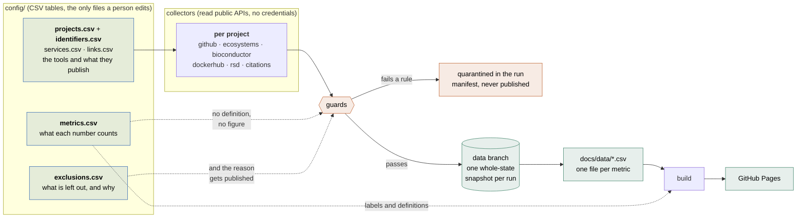

<picture>
  <source media="(prefers-color-scheme: dark)" srcset="docs/assets/images/logos/cdk.png">
  
</picture>

# CDK Outputs

**[cdk.github.io/cdk-outputs](https://cdk-um.github.io/cdk-outputs/)**

The software, data resources and services from the Chemistry Development Kit ecosystem.

## What this is not

It is **not** a bibliometric dashboard. The department's publication record lives in
Pure and is reported from there; duplicating it here would only produce a second set of
books that disagrees with the first. What this tracks is software: repositories,
releases, packages, containers, running services, and the citations of the papers that
describe each tool.

It is **not** a measure of individuals. There are no per-person pages, counts or
rankings, and there never will be — no person is queried and no ORCID is stored. Nor
are there stars, forks, h-indices or journal rankings: every figure names what it
counts, and the Methods page says what each one does not mean.

It is also not service monitoring. Whether the department's endpoints are up right now
is a different job with a different cadence, and the cluster already has monitoring for it.

## How it works



One GitHub Actions job, weekly, does the whole run: collect, check, build, deploy, then
commit the snapshot. Deploying in the same job is deliberate — a push made with
`GITHUB_TOKEN` does not trigger another workflow, which is how an earlier reporting
dashboard served a two-month-old page while every run showed green.

Three properties hold by construction, and each has a test:

- **Nothing is published without a definition.** A metric absent from
  `metrics.csv` does not render, and the Methods page is generated from
  that same file, so a definition cannot drift from the figure it describes.
- **A failed source reads as "not collected", never as 0.** Summing the records of a
  source that returned nothing gives zero, and a tile then states it as fact.
- **No stored credentials.** Every source is public. `tests/test_no_secrets_required.py`
  fails if that stops being true.

## Working on it

```bash
make install     # into a virtualenv
make check       # config validation, lint, offline tests
make offline     # build the entire site from fixtures, no network, no credentials
make serve       # http://localhost:8000
```

`make offline` is the one that matters. If it passes, the project can be forked, handed
over, and rebuilt in five years.

## Changing what is tracked

Everything a human edits lives in `config/` as a CSV table, one row per thing, so it
opens in a spreadsheet and a change reads as a one-line diff. `tgx doctor` validates
every table in CI — columns, foreign keys, enumerations — so a malformed change fails
the pull request rather than the next refresh. The columns are documented in
[`config/README.md`](config/README.md).

| To do this | Edit |
|---|---|
| Track another project | `config/projects.csv` and `config/identifiers.csv`, then `tgx doctor --projects` |
| Leave something out | `config/exclusions.csv`; a reason is required and is published |
| Add a number to the page | `config/metrics.csv` first, or it will not render |

To have a project, repository, package or DOI excluded from the queries, open an issue
or email the address in `config/settings.csv`. No reason is needed and none will be
asked for.

## Numbers that look wrong

They may well be. Every figure links to the CSV behind it and shows the exact source
and collection date, and the run manifests on the `data` branch record what each source
returned, what failed and what was quarantined.
[Open an issue](https://github.com/TGX-UM/tgx-outputs/issues/new) — see
[`RUNBOOK.md`](RUNBOOK.md) for what to do when a collector breaks.

## Prior art

Modelled on [RECETOX/specdatri_reporting](https://github.com/RECETOX/specdatri_reporting)
(MIT), the reporting tool RECETOX built for the same problem. The per-source card grid over
a per-project table is theirs, and several of the guards here exist because that project met
the failure first and it was worth turning into a test. No code was copied — this was written
from scratch — so the debt is one of design, and it is recorded in `CITATION.cff` and
`.zenodo.json` as well as here.

The [Research Software Directory](https://research-software-directory.org) already tracks
much of this department's software and computes literature mentions for it; this project
consumes that rather than rebuilding it.

## Licence

Code MIT. Figures are derived aggregates of public data; every source and its terms are
listed on the site's
[Methods page](https://tgx-um.github.io/tgx-outputs/methods/#sources), which is
generated from the same config the collectors read.
